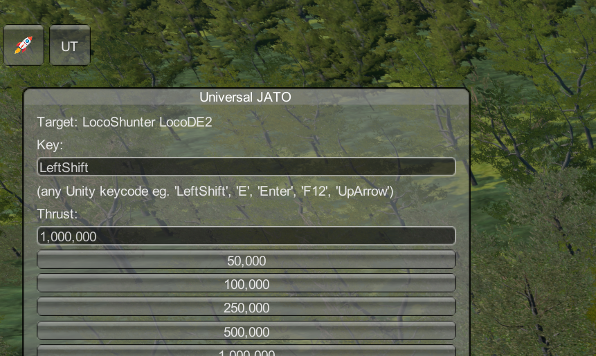

# Derail Valley Mod Toolbar

A framework mod for the game [Derail Valley](https://store.steampowered.com/app/588030/Derail_Valley/) to let mod authors add standard controls to a toolbar that open standard panels.



## Install

Download the zip and use Unity Mod Manager to install it.

## Using it in your mod

1. Add a dependency to this mod and ensure your mod loads after it
2. In your mod's `Load` register your mod and add your controls
3. Run game!

_Note: label is only used when you don't specify an icon and it is abbreviated (eg. "Universal JATO" becomes "UJ" and "Utilities" becomes "UT")._

Simple panel:

```cs
using DerailValleyModToolbar;

public static class Main
{
    void Load(ModEntry modEntry)
    {
        ModToolbarAPI
            .Register(modEntry)
            .AddPanelControl(
                label: "My Awesome Mod",
                icon: "icon.png", // relative to mod dir
                tooltip: "This is my awesome button!",
                onGUIContent: rect =>
                    {
                        GUILayout.Label("This is a window!");
                    },
                title: "My window")
            .Finish();
    }

    void Unload(ModEntry modEntry)
    {
        ModToolbarAPI.Unregister(modEntry);
    }
}
```

You can also add a button with an onClick:

```cs
ModToolbarAPI.AddControl(
    label: "ABC",
    icon: null,
    tooltip: "Click me plz!",
    onClick: () =>
    {
        modEntry.Logger.Log("You clicked me :)");
    });
```

If you want a bit more control over your editor you can supply your own panel:

```cs
class MyAwesomePanel : IModToolbarPanel
{
    public void Window(Rect rect)
    {
        GUILayout.Label("This is my panel!");
    }
}

ModToolbarAPI.AddPanelControl(
    label: "ABC",
    icon: null,
    tooltip: "This is my awesome button!",
    type: MyAwesomePanel,
    title: "My panel");
```

## Development

Template from https://github.com/derail-valley-modding/template-umm

Created in VSCode (with C# and C# Dev Kit extensions) and MSBuild.

1. Run `msbuild` in root to build

## Publishing

1. Run `.\package.ps1`

## Ideas

- use in-game toolbar (like for weather)
- panel resize
- adapt panel to content size
